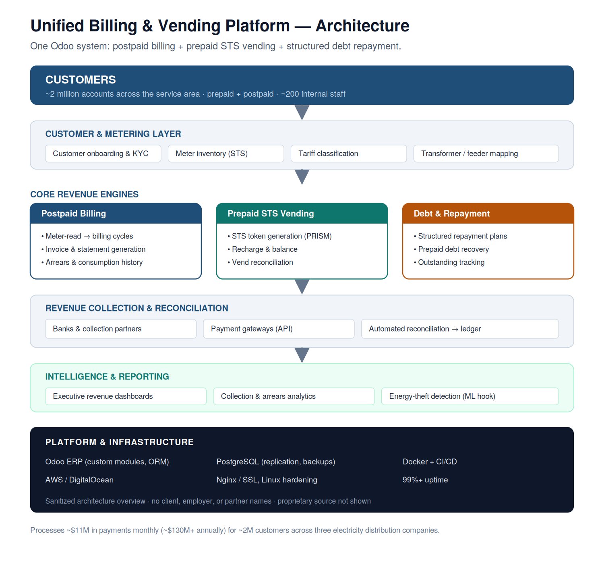

# Unified Billing & Vending Platform

**Postpaid billing + prepaid STS vending + structured debt repayment — in one Odoo system.**
Serving ~2 million electricity customers and processing ~\$11M/month.

> **Sanitized architecture case study.** No client, employer, or partner names appear here, and the source is private. This documents the system design and the decisions behind it — at the level of "how it's structured and why," not implementation detail.

---

## The problem

Electricity distribution companies typically run *separate* systems for prepaid and postpaid customers — different software, different teams, different reconciliation. That fragmentation creates revenue leakage, reconciliation gaps, and a fractured view of the customer.

The goal of this platform: **unify the entire revenue chain** — onboarding, metering, billing, vending, collection, and debt recovery — for a large, mixed prepaid/postpaid customer base, in a single system that ~200 internal staff across billing, metering, audit, accounts, and regional management use every day.

---

## System overview

The platform is organized as layers on top of an Odoo + PostgreSQL core:

- **Customer & metering layer** — onboarding/KYC, STS meter inventory, tariff classification, transformer/feeder mapping.
- **Core revenue engines** — three engines in one system:
  - **Postpaid billing** — meter-read-driven billing cycles, invoicing, arrears and consumption history.
  - **Prepaid STS vending** — standards-compliant token generation, recharge, balance, and vend reconciliation.
  - **Debt & repayment** — structured repayment plans and prepaid debt recovery, tracked against outstanding balances.
- **Revenue collection & reconciliation** — integrations with banks, collection partners, and payment gateways, feeding automated reconciliation into the ledger.
- **Intelligence & reporting** — executive revenue dashboards, collection/arrears analytics, and a hook for ML-based energy-theft detection.

---

## Key design decisions

**Why unify prepaid, postpaid, and debt in one system.**
Most billing software does one revenue model. Running prepaid and postpaid separately means two sources of truth, duplicated customer data, and reconciliation that never quite ties out. Unifying them — including structured debt repayment that works across *both* models — is the platform's core differentiator and its hardest engineering problem: one customer model, one ledger, one reconciliation pipeline.

**Why Odoo as the backbone.**
The work isn't just billing math — it's onboarding workflows, metering operations, audit trails, role-based access for ~200 staff, and reporting. Odoo provides that integrated business-process layer and the access control out of the box, so engineering effort goes into the revenue logic rather than rebuilding ERP plumbing.

**Reconciliation as a first-class concern.**
With multiple banks, collection partners, and gateways feeding payments, the hard part isn't taking money — it's *proving* every naira is accounted for. Automated reconciliation into a single ledger is what makes the \$11M/month auditable rather than just collected.

**Operated, not just built.**
The platform runs on hardened Linux infrastructure (AWS / DigitalOcean) with PostgreSQL replication and backups, containerized deployment, and CI/CD — maintaining a 99%+ uptime track record for a system three utilities depend on for revenue.

---

## Scale

| | |
|---|---|
| Customers served | ~2 million (prepaid + postpaid) |
| Internal users | ~200 across billing, metering, audit, accounts, regional mgmt |
| Payments processed | ~\$11M / month (~\$130M+ / year) |
| Uptime | 99%+ |

---

## Stack

`Odoo` · `Python` · `PostgreSQL` · `STS (PRISM)` · `Banking / gateway APIs` · `Docker` · `AWS / DigitalOcean` · `Nginx`

---

## About

Architected and operated by **Michael Kanu** — Senior Odoo ERP Architect specializing in energy & utility systems.

- **Email:** michaelkanu001@gmail.com
- **LinkedIn:** [michael-kanu](https://linkedin.com/in/michael-kanu-32966a111)
